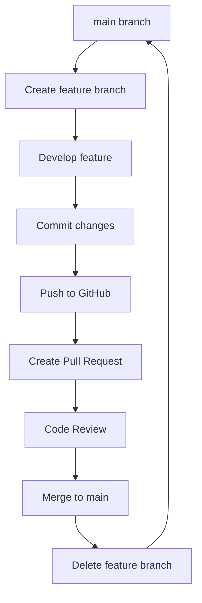

# Git Branching & Main Branch Workflow Guide

**Purpose:** Understanding professional Git workflow with branches  
**Audience:** Developers working solo or in teams  
**Date:** 2025-01-11

## 🌳 **What is a Branch?**

Think of Git branches like **parallel universes** for your code:
- Each branch is an **independent line of development**
- You can **switch between branches** instantly
- Changes in one branch **don't affect other branches**
- You can **merge branches** to combine changes

### **Visual Representation**
```
main branch:    A---B---C---F---G  (stable, production-ready)
                     \         /
feature branch:       D---E---/    (experimental, work-in-progress)
```

## 🏛️ **The Main Branch (Master/Main)**

### **What is the Main Branch?**
- **Default branch** created when you initialize a repository
- **Historically called "master"**, now commonly called "main"  
- **Single source of truth** for your project
- **Always deployable** - should never be broken
- **Protected branch** in professional environments

### **Why Main Branch is Sacred**
```
❌ BAD: Working directly on main
main: A---B---C---X (broken code)---Y (more broken code)---Z (oops!)
      ↑
   Other developers pull this broken code

✅ GOOD: Working on feature branches
main:           A---B---C---F (stable)
                     \     /
feature branch:       D---E (tested before merge)
```

### **Main Branch Rules**
1. **Never commit directly** to main (except for hotfixes)
2. **Always working** - code should build and tests pass
3. **Deployable at any time** - ready for production
4. **Receives changes via Pull Requests** only
5. **Protected by branch protection rules** in teams

## 🔀 **Feature Branch Workflow**

### **The Professional Pattern**



### **Step-by-Step Process**

#### **1. Start from Latest Main**
```bash
# Always start from the latest main
git checkout main
git pull origin main

# Create and switch to new feature branch
git checkout -b feature/user-authentication
```

#### **2. Work on Your Feature**
```bash
# Make your changes
# Edit files, add code, etc.

# Commit your work (multiple commits OK)
git add .
git commit -m "Add login form component"

git add .
git commit -m "Add form validation"

git add .
git commit -m "Connect to authentication API"
```

#### **3. Push Feature Branch**
```bash
# Push your feature branch to GitHub
git push -u origin feature/user-authentication
```

#### **4. Create Pull Request**
```bash
# Using GitHub CLI
gh pr create --title "Add user authentication" --body "Implements login/logout functionality with validation"

# Or via GitHub website
# Navigate to repository and click "Create Pull Request"
```

#### **5. Merge to Main**
```bash
# After review/approval, merge via GitHub UI
# Or via command line:
git checkout main
git pull origin main
git merge feature/user-authentication
git push origin main

# Clean up
git branch -d feature/user-authentication
git push origin --delete feature/user-authentication
```

## 🏗️ **Branch Naming Conventions**

### **Common Patterns**
```bash
# Feature branches
feature/user-authentication
feature/payment-integration
feature/dashboard-ui

# Bug fixes
bugfix/login-redirect-error
fix/memory-leak-dashboard
hotfix/critical-security-patch

# Experimental work
experiment/new-ui-framework
spike/performance-testing
research/database-alternatives

# Release branches (for teams)
release/v1.2.0
release/2025-01-15
```

### **Best Practices for Branch Names**
- **Use lowercase** and hyphens (not underscores)
- **Be descriptive** but concise
- **Include ticket numbers** if using issue tracking
  ```bash
  feature/123-user-authentication
  bugfix/456-login-redirect
  ```

## 🔄 **Common Branching Workflows**

### **1. GitHub Flow (Recommended for Solo/Small Teams)**
```
main ────┬─────────────────┬─────────────► (always deployable)
         │                 │
         └─ feature ──────┘ (short-lived)
```

**Process:**
1. Create feature branch from main
2. Develop and commit
3. Create Pull Request
4. Merge to main
5. Deploy from main

### **2. Git Flow (Complex Projects)**
```
main ────────────────────────────────────► (production releases)
         │                        │
develop ─┴─┬─────────────┬─────────┴─────► (integration)
            │             │
            └─ feature ──┘ (features)
```

**Process:**
1. Develop branch for integration
2. Feature branches from develop
3. Merge features to develop
4. Release branches from develop to main

### **3. Your Multi-Computer Workflow**
```bash
# Desktop: Start feature
git checkout main
git pull origin main
git checkout -b feature/new-dashboard

# Work and commit
git add . && git commit -m "WIP: Desktop - Layout structure"
git push origin feature/new-dashboard

# Laptop: Continue feature  
git checkout feature/new-dashboard
git pull origin feature/new-dashboard

# Work and commit
git add . && git commit -m "WIP: Laptop - Added components"
git push origin feature/new-dashboard

# Desktop: Finish feature
git pull origin feature/new-dashboard
git add . && git commit -m "feat: Complete dashboard with responsive design"
git push origin feature/new-dashboard

# Create PR and merge to main
gh pr create --title "New Dashboard" --body "Complete dashboard implementation"
```

## 🛠️ **Essential Git Commands for Branches**

### **Basic Branch Operations**
```bash
# List all branches
git branch -a

# Create new branch
git branch feature/new-feature

# Create and switch to new branch
git checkout -b feature/new-feature

# Switch to existing branch
git checkout feature/existing-feature

# Delete local branch
git branch -d feature/completed-feature

# Delete remote branch
git push origin --delete feature/completed-feature
```

### **Branch Synchronization**
```bash
# Update current branch from remote
git pull origin current-branch-name

# Push current branch to remote
git push origin current-branch-name

# Set upstream for new branch
git push -u origin new-branch-name

# Fetch all branches from remote
git fetch --all
```

### **Merging and Integration**
```bash
# Merge feature branch into main
git checkout main
git pull origin main
git merge feature/completed-feature

# Merge with commit message
git merge feature/completed-feature -m "Merge user authentication feature"

# Rebase feature branch onto main (advanced)
git checkout feature/my-feature
git rebase main
```

## 🚨 **Common Branch Mistakes & Solutions**

### **Mistake 1: Working Directly on Main**
```bash
❌ git checkout main
❌ # make changes
❌ git add . && git commit -m "Quick fix"

✅ git checkout main
✅ git checkout -b hotfix/quick-fix
✅ # make changes
✅ git add . && git commit -m "Fix critical issue"
✅ git push origin hotfix/quick-fix
✅ # Create PR to merge back to main
```

### **Mistake 2: Not Starting from Latest Main**
```bash
❌ git checkout -b feature/new-thing
❌ # Branch might be outdated!

✅ git checkout main
✅ git pull origin main
✅ git checkout -b feature/new-thing
```

### **Mistake 3: Merging Without Review**
```bash
❌ git checkout main
❌ git merge feature/untested-feature
❌ git push origin main

✅ git push origin feature/tested-feature
✅ gh pr create --title "New Feature"
✅ # Wait for review, then merge via GitHub
```

### **Mistake 4: Not Cleaning Up Branches**
```bash
# After merging, clean up
git branch -d feature/completed-feature
git push origin --delete feature/completed-feature
```

## 📋 **Branch Protection Rules (Team Settings)**

### **GitHub Branch Protection (Recommended Settings)**
```
Protected Branch: main

Settings:
☑️ Require pull request reviews before merging
☑️ Require status checks to pass before merging  
☑️ Require branches to be up to date before merging
☑️ Require linear history
☑️ Delete head branches automatically
☐ Allow force pushes (keep disabled)
☐ Allow deletions (keep disabled)
```

### **Setting Up Protection Rules**
```bash
# Via GitHub CLI
gh api repos/:owner/:repo/branches/main/protection \
  --method PUT \
  --field required_status_checks='{"strict":true,"contexts":[]}' \
  --field enforce_admins=true \
  --field required_pull_request_reviews='{"required_approving_review_count":1}' \
  --field restrictions=null
```

## 🔧 **Automation Scripts for Your Workflow**

### **New Feature Script**
```powershell
# File: scripts/new-feature.ps1
param([Parameter(Mandatory=$true)][string]$FeatureName)

Write-Host "🚀 Starting new feature: $FeatureName" -ForegroundColor Cyan

# Ensure we're on main and up to date
git checkout main
git pull origin main

# Create and switch to new feature branch
$branchName = "feature/$FeatureName"
git checkout -b $branchName

# Push branch to remote
git push -u origin $branchName

Write-Host "✅ Feature branch '$branchName' created and ready!" -ForegroundColor Green
Write-Host "💡 Start developing, then use 'scripts/finish-feature.ps1' when done" -ForegroundColor Yellow
```

### **Finish Feature Script**
```powershell
# File: scripts/finish-feature.ps1
param([string]$Title, [string]$Description)

$currentBranch = git branch --show-current

Write-Host "🏁 Finishing feature: $currentBranch" -ForegroundColor Cyan

# Final commit
git add .
$commitMsg = Read-Host "Final commit message"
git commit -m $commitMsg

# Push final changes
git push origin $currentBranch

# Create Pull Request
if ($Title -and $Description) {
    gh pr create --title $Title --body $Description
} else {
    gh pr create
}

Write-Host "✅ Pull request created!" -ForegroundColor Green
Write-Host "🔗 Review and merge at: https://github.com/username/repo/pulls" -ForegroundColor Cyan
```

### **Clean Branches Script**
```powershell
# File: scripts/clean-branches.ps1
Write-Host "🧹 Cleaning up merged branches..." -ForegroundColor Cyan

# Switch to main
git checkout main
git pull origin main

# Get merged branches (excluding main)
$mergedBranches = git branch --merged | Where-Object { $_ -notmatch '\*|main|master' } | ForEach-Object { $_.Trim() }

foreach ($branch in $mergedBranches) {
    Write-Host "🗑️ Deleting local branch: $branch" -ForegroundColor Yellow
    git branch -d $branch
    
    # Try to delete remote branch (might not exist)
    try {
        git push origin --delete $branch 2>$null
        Write-Host "🗑️ Deleted remote branch: $branch" -ForegroundColor Yellow
    } catch {
        # Remote branch might not exist, ignore
    }
}

Write-Host "✅ Branch cleanup complete!" -ForegroundColor Green
```

## 📊 **Branch Visualization Tools**

### **Command Line Visualization**
```bash
# Pretty log with branch visualization
git log --oneline --graph --decorate --all

# Alias for easier use
git config --global alias.tree "log --oneline --graph --decorate --all"

# Usage
git tree
```

### **VS Code Extensions**
- **GitLens** - Supercharged Git visualization
- **Git Graph** - Visual branch timeline
- **Git History** - File and branch history

### **GitHub Desktop**
- Visual branch switching and merging
- Pull request management
- Merge conflict resolution

## 🎯 **Your Specific Multi-Computer Workflow**

### **Desktop Workflow**
```powershell
# Starting work on desktop
scripts/new-feature.ps1 -FeatureName "user-dashboard"

# Work on feature...
git add . && git commit -m "WIP: Desktop - Dashboard layout"
git push origin feature/user-dashboard

# Switch to laptop
scripts/switch-machine.ps1 -CurrentMachine "Desktop"
```

### **Laptop Workflow**
```powershell
# Continue on laptop
git checkout feature/user-dashboard  
git pull origin feature/user-dashboard

# Work continues...
git add . && git commit -m "WIP: Laptop - Added components"
git push origin feature/user-dashboard

# Switch back to desktop
scripts/switch-machine.ps1 -CurrentMachine "Laptop"
```

### **Finishing Work**
```powershell
# Final work on desktop
git pull origin feature/user-dashboard

# Complete feature
git add . && git commit -m "feat: Complete user dashboard with responsive design"
git push origin feature/user-dashboard

# Create PR and merge
scripts/finish-feature.ps1 -Title "User Dashboard" -Description "Complete dashboard implementation with responsive design"
```

## 📚 **Branch Strategy Summary**

### **Why This System Works**
✅ **Isolation** - Features don't interfere with each other  
✅ **Safety** - Main branch always stable  
✅ **Collaboration** - Multiple people can work simultaneously  
✅ **Review** - Code gets reviewed before merging  
✅ **History** - Clear record of what changed when  
✅ **Rollback** - Easy to revert problematic changes  

### **Key Principles**
1. **Main is sacred** - never broken, always deployable
2. **One feature, one branch** - focused development
3. **Short-lived branches** - merge quickly to avoid conflicts
4. **Pull Request workflow** - code review and quality
5. **Clean history** - meaningful commits and messages

### **Your Benefits**
- ✅ **Multi-computer sync** via feature branches
- ✅ **Safe experimentation** without breaking main
- ✅ **Professional workflow** following industry standards
- ✅ **Easy collaboration** when working with others
- ✅ **Clean project history** for debugging and auditing

---

## 🏁 **Quick Reference**

### **Daily Commands**
```bash
# Start new work
git checkout main && git pull origin main && git checkout -b feature/my-feature

# Save progress  
git add . && git commit -m "WIP: Progress description" && git push origin feature/my-feature

# Switch machines
git push origin feature/my-feature    # On current machine
git pull origin feature/my-feature    # On other machine

# Finish feature
git add . && git commit -m "feat: Complete feature" && git push origin feature/my-feature
gh pr create --title "Feature Title" --body "Description"
```

**Status:** 🌳 **Professional Git Branching Workflow Ready**

**Remember:** Main branch = Production. Feature branches = Development. Always use feature branches! 🚀