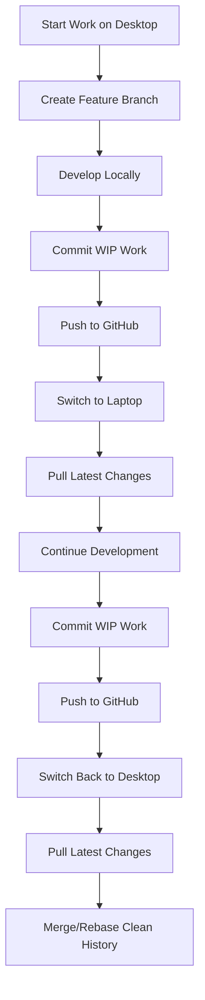

# Multi-Computer Development Workflow

**Scenario:** Working on Desktop (alphadev) + Laptop (alphadev2)  
**Challenge:** Keeping development work synchronized across machines  
**Date:** 2025-01-11

## 🎯 **The Problem**

You're working on **Feature 1** on Desktop:
- ✅ Most development files are local (uncommitted)
- ✅ Only some changes committed to Git/GitHub
- ❌ **Local changes not accessible** from Laptop
- ❌ **Risk of losing work** if not properly synchronized

## 💡 **Industry Best Practices**

### **The Golden Rules**
1. **Git is your single source of truth**
2. **Commit early, commit often** (even incomplete work)
3. **Use branches for features** (never work directly on main)
4. **Always sync before switching machines**
5. **Never leave uncommitted work when switching**

### **What Professional Developers Do**
- **Feature branches** for all work
- **Work-in-progress (WIP) commits** for synchronization
- **Stash or commit** before every machine switch
- **Pull-first** workflow on every machine switch

## 🔄 **Recommended Multi-Computer Workflow**

### **Core Workflow Pattern**



## 🛠️ **Implementation Strategy**

### **Phase 1: Standardize Directory Structure**

Both computers should have identical setup:

#### **Desktop (Current: alphadev)**
```powershell
# Rename to match laptop structure
Move-Item "C:\Users\user\alphadev" "C:\Users\user\alphadev2"

# Or create symbolic link if you prefer keeping alphadev
# mklink /D "C:\Users\user\alphadev2" "C:\Users\user\alphadev"
```

#### **Result: Both Computers**
```
C:\Users\user\alphadev2\
├── projects\web\
├── secrets\credentials\
├── scripts\
└── [same structure on both]
```

### **Phase 2: Git Configuration for Multi-Computer**

#### **Enhanced Git Setup for Both Machines**
```powershell
# Set up better commit messages for multi-computer work
git config --global commit.template "C:\Users\user\alphadev2\config\.gitmessage"

# Create commit message template
$commitTemplate = @"
# [COMPUTER: Desktop/Laptop] Brief description

# What was done:
# - 
# - 

# What's next:
# - 
# - 

# Notes:
# - 
"@

$commitTemplate | Out-File "C:\Users\user\alphadev2\config\.gitmessage" -Encoding UTF8
```

#### **Configure Computer-Specific Git Identity**
```powershell
# Desktop
git config --global user.name "Bruce Thinkpad (Desktop)"
git config --global user.email "padocs+desktop@gmail.com"

# Laptop  
git config --global user.name "Bruce Thinkpad (Laptop)"
git config --global user.email "padocs+laptop@gmail.com"
```

### **Phase 3: Feature Branch Workflow**

#### **Starting New Feature (Desktop)**
```powershell
cd "C:\Users\user\alphadev2\projects\web\my-project"

# Always start from latest main
git checkout main
git pull origin main

# Create feature branch
git checkout -b feature/user-authentication
git push -u origin feature/user-authentication

# Now develop...
# Make changes to files...

# Commit WIP work before switching computers
git add .
git commit -m "WIP: Desktop - Added login form components

- Created LoginForm component
- Added basic validation
- TODO: Implement API integration
- TODO: Add error handling

[COMPUTER: Desktop]"

git push origin feature/user-authentication
```

#### **Continuing on Laptop**
```powershell
cd "C:\Users\user\alphadev2\projects\web\my-project"

# Pull latest changes
git checkout feature/user-authentication
git pull origin feature/user-authentication

# Continue development...
# Make more changes...

# Commit your laptop work
git add .
git commit -m "WIP: Laptop - Implemented API integration

- Added authentication service
- Connected login form to API
- TODO: Add error handling
- TODO: Add loading states

[COMPUTER: Laptop]"

git push origin feature/user-authentication
```

#### **Back to Desktop**
```powershell
cd "C:\Users\user\alphadev2\projects\web\my-project"

# Pull latest changes from laptop
git pull origin feature/user-authentication

# Continue development...
# Complete the feature...

# Final clean commit
git add .
git commit -m "feat: Complete user authentication system

- Implemented login/logout functionality
- Added form validation and error handling
- Added loading states and user feedback
- Tests added for authentication flow

Closes #123

[COMPUTER: Desktop - Final]"

git push origin feature/user-authentication

# Create PR
gh pr create --title "feat: User Authentication System" --body "Complete implementation of user login/logout with validation"
```

## 🔧 **Automation Scripts for Workflow**

### **Machine Switch Script**
```powershell
# File: scripts/switch-machine.ps1
param(
    [Parameter(Mandatory=$true)]
    [ValidateSet("Desktop", "Laptop")]
    [string]$CurrentMachine,
    
    [string]$Message = "WIP: Switching to other machine"
)

Write-Host "🔄 Preparing to switch from $CurrentMachine..." -ForegroundColor Cyan

# Check for uncommitted changes
$status = git status --porcelain
if ($status) {
    Write-Host "📝 Found uncommitted changes. Committing..." -ForegroundColor Yellow
    
    git add .
    $commitMessage = "$Message`n`n[COMPUTER: $CurrentMachine - WIP]`n[TIMESTAMP: $(Get-Date -Format 'yyyy-MM-dd HH:mm:ss')]"
    git commit -m $commitMessage
    
    Write-Host "✅ Changes committed" -ForegroundColor Green
} else {
    Write-Host "✅ No uncommitted changes found" -ForegroundColor Green
}

# Push to remote
$currentBranch = git branch --show-current
git push origin $currentBranch

Write-Host "🚀 All changes pushed to origin/$currentBranch" -ForegroundColor Green
Write-Host "💻 Ready to switch to other machine!" -ForegroundColor Cyan

Write-Host "`nOn the other machine, run:" -ForegroundColor Yellow
Write-Host "git pull origin $currentBranch" -ForegroundColor White
```

### **Start Work Script**
```powershell
# File: scripts/start-work.ps1
param(
    [Parameter(Mandatory=$true)]
    [ValidateSet("Desktop", "Laptop")]
    [string]$CurrentMachine,
    
    [string]$ProjectName = ""
)

Write-Host "🚀 Starting work on $CurrentMachine..." -ForegroundColor Cyan

if ($ProjectName) {
    Set-Location "C:\Users\user\alphadev2\projects\web\$ProjectName"
}

# Pull latest changes
$currentBranch = git branch --show-current
Write-Host "📥 Pulling latest changes from origin/$currentBranch..." -ForegroundColor Yellow
git pull origin $currentBranch

# Show recent commits
Write-Host "`n📋 Recent commits:" -ForegroundColor Yellow
git log --oneline -5

# Show current status
Write-Host "`n📊 Current status:" -ForegroundColor Yellow
git status

Write-Host "`n✅ Ready to start work on $CurrentMachine!" -ForegroundColor Green
```

### **Daily Sync Script**
```powershell
# File: scripts/daily-sync.ps1
Write-Host "🔄 Daily synchronization starting..." -ForegroundColor Cyan

# Get all project directories
$projectDirs = Get-ChildItem "C:\Users\user\alphadev2\projects\web" -Directory

foreach ($project in $projectDirs) {
    Write-Host "`nProcessing: $($project.Name)" -ForegroundColor Yellow
    Set-Location $project.FullName
    
    # Skip if not a git repository
    if (-not (Test-Path ".git")) {
        Write-Host "  ⏭️ Skipping (not a git repo)" -ForegroundColor Gray
        continue
    }
    
    # Get current branch
    $currentBranch = git branch --show-current
    
    # Stash any uncommitted changes
    $status = git status --porcelain
    $stashed = $false
    if ($status) {
        git stash push -m "Auto-stash for daily sync $(Get-Date -Format 'yyyy-MM-dd HH:mm')"
        $stashed = $true
        Write-Host "  📦 Stashed uncommitted changes" -ForegroundColor Yellow
    }
    
    # Pull latest changes
    try {
        git pull origin $currentBranch
        Write-Host "  ✅ $($project.Name) - Updated" -ForegroundColor Green
    }
    catch {
        Write-Host "  ❌ $($project.Name) - Pull failed: $_" -ForegroundColor Red
    }
    
    # Restore stashed changes
    if ($stashed) {
        git stash pop
        Write-Host "  📤 Restored stashed changes" -ForegroundColor Yellow
    }
}

Write-Host "`n🎉 Daily sync complete!" -ForegroundColor Green
```

## 📱 **Alternative Solutions**

### **Option 1: Cloud Development Environment**

#### **GitHub Codespaces**
```powershell
# Work entirely in the browser/VS Code
# Access from: https://github.com/codespaces

# Benefits:
# ✅ Same environment everywhere
# ✅ No local sync issues
# ✅ Powerful cloud computing
# ❌ Requires internet
# ❌ Monthly cost
```

#### **Gitpod**
```powershell
# Open any GitHub repo in cloud IDE
# URL: https://gitpod.io/#https://github.com/username/repo

# Benefits:
# ✅ Free tier available
# ✅ Instant setup
# ✅ No local dependencies
# ❌ Requires internet
```

### **Option 2: File Synchronization**

#### **OneDrive/Dropbox Sync (NOT Recommended)**
```powershell
# ❌ DON'T do this:
# Moving alphadev2 to OneDrive folder
# Issues:
# - Git conflicts
# - File locking issues
# - Performance problems
# - Node modules sync issues
```

#### **Better Alternative: Selective Sync**
```powershell
# Sync only specific files via cloud storage
$syncFiles = @(
    "notes.md",
    "todo.md", 
    ".env.example",
    "docs/*"
)

# Keep in cloud storage folder, symlink to project
foreach ($file in $syncFiles) {
    # Create symlinks to cloud-synced files
}
```

### **Option 3: Remote Development**

#### **SSH into Desktop from Laptop**
```powershell
# Enable SSH on Desktop
Add-WindowsCapability -Online -Name OpenSSH.Server~~~~0.0.1.0
Start-Service sshd
Set-Service -Name sshd -StartupType 'Automatic'

# Connect from laptop
ssh username@desktop-ip

# Use VS Code Remote SSH
# Install "Remote - SSH" extension
# Connect to desktop and work on files directly
```

#### **Benefits of Remote Development:**
- ✅ Single source of truth (Desktop)
- ✅ No sync issues
- ✅ Full access to Desktop resources
- ❌ Requires network connection
- ❌ Performance depends on connection quality

## 🎯 **Recommended Workflow for Your Situation**

### **Primary Strategy: Enhanced Git Workflow**

```powershell
# Desktop workflow
function Start-DesktopWork {
    cd "C:\Users\user\alphadev2\projects\web\$ProjectName"
    git checkout main
    git pull origin main
    git checkout -b "feature/new-feature" 2>$null || git checkout "feature/new-feature"
    git pull origin "feature/new-feature" 2>$null
}

function End-DesktopWork {
    git add .
    git commit -m "WIP: Desktop work - $(Get-Date -Format 'HH:mm')

$(Read-Host 'Brief description of what was done')"
    git push origin (git branch --show-current)
}

# Laptop workflow  
function Start-LaptopWork {
    cd "C:\Users\user\alphadev2\projects\web\$ProjectName"
    git checkout "feature/new-feature"
    git pull origin "feature/new-feature"
}

function End-LaptopWork {
    git add .
    git commit -m "WIP: Laptop work - $(Get-Date -Format 'HH:mm')

$(Read-Host 'Brief description of what was done')"
    git push origin (git branch --show-current)
}
```

### **Secondary Strategy: VS Code Remote SSH**

For immediate access to Desktop files from Laptop:

1. **Enable SSH on Desktop**
2. **Install VS Code Remote-SSH extension on Laptop**
3. **Connect to Desktop and work directly on files**

### **Emergency Strategy: Git Stash + WIP Commits**

When you forget to commit before switching:

```powershell
# On machine with uncommitted work
git stash push -m "Emergency stash before machine switch"
git push origin current-branch

# On other machine  
git pull origin current-branch
# Work gets automatically merged when you return and pop stash
```

## 📋 **Daily Workflow Checklist**

### **Before Starting Work (Any Machine)**
- [ ] `git pull origin branch-name`
- [ ] Check for any merge conflicts
- [ ] Run `npm install` if package.json changed
- [ ] Verify environment is working

### **Before Switching Machines**
- [ ] `git add .`
- [ ] `git commit -m "WIP: [description]"`
- [ ] `git push origin branch-name`
- [ ] Verify push succeeded

### **After Switching Machines**
- [ ] `git pull origin branch-name`  
- [ ] Check for any merge conflicts
- [ ] Continue work from where left off
- [ ] Test that everything still works

## 🔧 **Setup Commands for Both Machines**

Run these on both Desktop and Laptop:

```powershell
# Standardize directory names (if needed)
# Desktop: Rename alphadev to alphadev2
# Laptop: Already alphadev2

# Install workflow scripts
cd "C:\Users\user\alphadev2"
# Copy all the scripts above into scripts/ folder

# Set up Git aliases for easier workflow
git config --global alias.sync-start '!f() { git pull origin $(git branch --show-current); }; f'
git config --global alias.sync-end '!f() { git add . && git commit -m "WIP: $1" && git push origin $(git branch --show-current); }; f'
git config --global alias.wip '!f() { git add . && git commit -m "WIP: $1"; }; f'

# Test the setup
Write-Host "✅ Multi-computer workflow setup complete!" -ForegroundColor Green
```

## 🎉 **Expected Results**

After implementing this workflow:

- ✅ **Seamless switching** between Desktop and Laptop
- ✅ **No lost work** - everything always committed
- ✅ **Clean history** when feature is complete
- ✅ **Full traceability** of work done on which machine
- ✅ **Emergency recovery** if something goes wrong

## 💡 **Pro Tips**

1. **Use descriptive WIP commits** - Future you will thank you
2. **Create aliases** for common operations to reduce typing
3. **Set up automated daily sync** to catch anything missed
4. **Use VS Code Remote-SSH** for urgent access to other machine's files
5. **Keep notes in cloud** (separate from code) for context switching

---

Your multi-computer development workflow is now **professional-grade** and follows industry best practices! 🚀

**Status:** ✅ **Multi-Computer Workflow Ready**

**Quick Start:** Use `scripts/switch-machine.ps1` and `scripts/start-work.ps1` to automate the process!