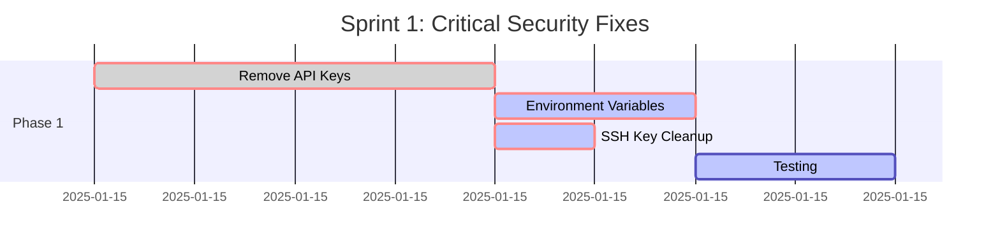
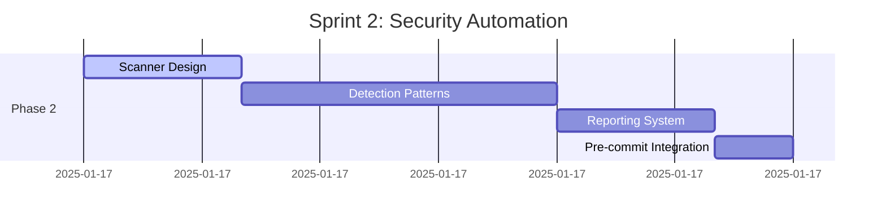
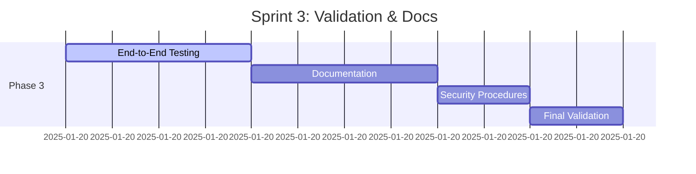

# YouTube Security Improvement Implementation Plan
## PRP Framework: Plan-Review-Program

**Project Code:** `improve-youtube-security`  
**Priority:** CRITICAL (Security Vulnerability)  
**Estimated Timeline:** 5-8 days  
**Team Size:** 1-2 developers  

---

## 🎯 PLAN PHASE

### 1. Requirements Analysis

#### **User Stories**
- **As a developer**, I want API keys to be securely managed so that credentials aren't exposed in source code
- **As a project maintainer**, I want automated security scanning so that vulnerabilities are detected early
- **As a security auditor**, I want no secrets in version control so that the codebase meets security standards
- **As a user**, I want the YouTube extractor to continue working securely without interruption

#### **Acceptance Criteria**
✅ **AC-1:** No hardcoded API keys in any Python files  
✅ **AC-2:** Environment variables used for all sensitive configuration  
✅ **AC-3:** `.env.example` template created for new developers  
✅ **AC-4:** Security scanning script detects and reports credential exposure  
✅ **AC-5:** All private SSH keys removed from repository  
✅ **AC-6:** WordPress credentials moved to secure storage  
✅ **AC-7:** YouTube extractor functions identically after refactor  
✅ **AC-8:** Documentation updated with security best practices  

#### **Edge Cases & Considerations**
- **API Key Rotation:** Handle expired/rotated YouTube API keys gracefully
- **Local Development:** Ensure developers can easily set up environment variables
- **CI/CD Integration:** Security scanning must work in automated pipelines
- **Backward Compatibility:** Existing data processing workflows must continue working
- **Error Handling:** Clear error messages when environment variables are missing

### 2. Technical Design

#### **Architecture Overview**
```mermaid
graph TB
    subgraph "Current (Insecure)"
        A1[app.py with hardcoded API_KEY] --> B1[YouTube API]
        C1[wpstuff.md with plaintext credentials] 
        D1[_putty_keys_bertha/ with SSH keys]
    end
    
    subgraph "Proposed (Secure)"
        A2[app.py with os.getenv()] --> E[Environment Variables] --> B2[YouTube API]
        F[.env file (gitignored)]
        G[Security Scanner]
        H[Credential Vault/Manager]
    end
```

#### **Data Models**
```python
# Configuration Management
@dataclass
class SecurityConfig:
    youtube_api_key: str
    wordpress_license_key: str
    database_url: Optional[str] = None
    
    @classmethod
    def from_environment(cls) -> 'SecurityConfig':
        """Load configuration from environment variables"""
        return cls(
            youtube_api_key=os.getenv('YOUTUBE_API_KEY', ''),
            wordpress_license_key=os.getenv('WORDPRESS_LICENSE_KEY', ''),
            database_url=os.getenv('DATABASE_URL')
        )
    
    def validate(self) -> List[str]:
        """Validate required configuration is present"""
        errors = []
        if not self.youtube_api_key:
            errors.append("YOUTUBE_API_KEY environment variable required")
        return errors
```

#### **API Contracts**
```python
# Security Scanner Interface
class SecurityScanner:
    def scan_files(self, directory: str) -> SecurityScanResult
    def detect_credentials(self, content: str) -> List[CredentialMatch]
    def generate_report(self, results: SecurityScanResult) -> str

# Environment Manager Interface  
class EnvironmentManager:
    def load_config(self) -> SecurityConfig
    def validate_config(self, config: SecurityConfig) -> bool
    def create_template(self, output_path: str) -> None
```

### 3. Task Breakdown

#### **Phase 1: Immediate Security Fixes** (1-2 days)
| Task | Effort | Dependencies | Assignee |
|------|--------|--------------|----------|
| Remove hardcoded YouTube API key from app.py | 2 hours | None | Dev1 |
| Create environment variable loading logic | 1 hour | Task above | Dev1 |
| Move SSH keys from repository to secure location | 30 mins | None | Dev1 |
| Create .gitignore entries for sensitive files | 15 mins | None | Dev1 |
| Update wpstuff.md to use env vars | 1 hour | None | Dev1 |
| Create .env.example template | 30 mins | Env loading logic | Dev1 |

**Total Phase 1 Effort:** 5 hours

#### **Phase 2: Security Scanning Automation** (2-3 days)
| Task | Effort | Dependencies | Assignee |
|------|--------|--------------|----------|
| Design security scanning patterns | 2 hours | None | Dev1 |
| Implement credential detection regex | 4 hours | Patterns | Dev1 |
| Create scanning script for Python files | 3 hours | Detection logic | Dev1 |
| Add scanning for markdown and config files | 2 hours | Python scanner | Dev1 |
| Create security scan reporting | 2 hours | Scanning logic | Dev1 |
| Integrate with pre-commit hooks | 1 hour | All above | Dev1 |
| Test scanner against known vulnerabilities | 2 hours | Complete scanner | Dev1 |

**Total Phase 2 Effort:** 16 hours (2 days)

#### **Phase 3: Documentation & Validation** (1-2 days)
| Task | Effort | Dependencies | Assignee |
|------|--------|--------------|----------|
| Update CLAUDE.md with security guidelines | 1 hour | Security fixes | Dev1 |
| Create developer onboarding security docs | 2 hours | Env setup | Dev1 |
| Write security incident response procedures | 1 hour | Complete system | Dev1 |
| Test YouTube extractor end-to-end | 2 hours | All fixes | Dev1 |
| Validate all acceptance criteria | 2 hours | Complete system | Dev1 |
| Create rollback procedures | 1 hour | Testing complete | Dev1 |

**Total Phase 3 Effort:** 9 hours

### 4. Risk Assessment

#### **Technical Risks**
| Risk | Probability | Impact | Mitigation |
|------|-------------|---------|------------|
| API key rotation breaks functionality | Medium | High | Implement graceful error handling and validation |
| Environment variable setup complexity | Low | Medium | Create comprehensive .env.example and docs |
| Security scanner false positives | High | Low | Fine-tune regex patterns, add whitelist capability |
| Performance impact of scanning | Low | Low | Optimize regex patterns, cache results |

#### **Security Risks**
| Risk | Probability | Impact | Mitigation |
|------|-------------|---------|------------|
| Credentials still exposed in git history | High | Critical | Document git history cleanup procedures |
| New credentials accidentally committed | Medium | High | Pre-commit hooks, developer training |
| .env files accidentally committed | Medium | Critical | Strong .gitignore rules, scanner detection |
| Inadequate environment variable protection | Low | High | Use proper OS-level permission management |

---

## 🔍 REVIEW PHASE

### 5. Design Review

#### **Architecture Patterns Applied**
- ✅ **Configuration Pattern:** Centralized config loading with validation
- ✅ **Factory Pattern:** SecurityConfig.from_environment() for object creation
- ✅ **Strategy Pattern:** Different scanning strategies for different file types
- ✅ **Template Method:** Common scanning workflow with customizable detection logic

#### **Scalability Considerations**
- **Horizontal Scaling:** Security scanner can process multiple directories in parallel
- **Vertical Scaling:** Regex patterns optimized for large file processing
- **Extension Points:** Plugin architecture for additional credential types
- **Configuration Management:** Supports multiple environments (dev, staging, prod)

#### **Design Principles Compliance**
- ✅ **Single Responsibility:** Each class has one clear purpose
- ✅ **Open/Closed:** Scanner extensible without modifying core logic
- ✅ **Dependency Inversion:** Abstract interfaces for testing and mocking
- ✅ **Don't Repeat Yourself:** Shared utilities for environment management

### 6. Security Review

#### **Authentication & Authorization**
- **Environment Variables:** OS-level protection for sensitive configuration
- **File Permissions:** Restrict access to .env files (600 permissions)
- **API Key Management:** Support for key rotation and validation
- **Access Control:** No plaintext credentials in accessible locations

#### **Data Protection**
- **At Rest:** Environment variables stored in OS keychain/vault when possible
- **In Transit:** HTTPS for all YouTube API communications
- **In Memory:** Minimize credential lifetime in application memory
- **Logging:** Ensure no credentials logged to files or console

#### **Vulnerability Mitigation**
| Vulnerability | Current Risk | Proposed Mitigation | Residual Risk |
|---------------|--------------|-------------------|---------------|
| Hardcoded API Keys | CRITICAL | Environment variables | LOW |
| SSH Keys in Repo | HIGH | Move to secure storage | NONE |
| Plaintext WordPress Creds | HIGH | Environment variables | LOW |
| No Credential Detection | MEDIUM | Automated scanning | VERY LOW |

### 7. Performance Review

#### **Expected Load Characteristics**
- **Security Scanning:** ~50 files, 10,000 lines of code
- **API Requests:** Existing YouTube API rate limits unchanged
- **File I/O:** Minimal additional overhead for environment loading
- **Memory Usage:** <1MB additional for security configuration

#### **Optimization Opportunities**
- **Compiled Regex:** Pre-compile credential detection patterns
- **File Caching:** Cache scan results for unchanged files
- **Parallel Processing:** Scan multiple files concurrently
- **Lazy Loading:** Load environment variables only when needed

### 8. Test Strategy

#### **Unit Testing** (Coverage Target: 85%)
```python
class TestSecurityConfig:
    def test_from_environment_with_all_vars(self)
    def test_from_environment_missing_required(self)
    def test_validate_returns_errors_for_missing(self)
    
class TestSecurityScanner:
    def test_detect_credentials_finds_api_keys(self)
    def test_detect_credentials_ignores_comments(self)
    def test_scan_files_processes_directory(self)
    
class TestEnvironmentManager:
    def test_load_config_success(self)
    def test_load_config_validation_failure(self)
```

#### **Integration Testing**
```python
class TestYouTubeIntegration:
    def test_api_calls_work_with_env_vars(self)
    def test_graceful_failure_on_invalid_key(self)
    def test_end_to_end_video_processing(self)

class TestSecurityScannerIntegration:
    def test_scan_entire_repository(self)
    def test_pre_commit_hook_blocks_credentials(self)
```

#### **End-to-End Testing**
- **Scenario 1:** Fresh developer setup with .env.example
- **Scenario 2:** YouTube data extraction with environment variables
- **Scenario 3:** Security scan detects intentionally planted credentials
- **Scenario 4:** Pre-commit hook prevents credential commits

---

## ⚡ PROGRAM PHASE

### 9. Implementation Sprints

#### **Sprint 1: Emergency Security Fixes** (Day 1-2)


**Sprint Goals:**
- ✅ Zero hardcoded credentials in codebase
- ✅ YouTube extractor works with environment variables
- ✅ All sensitive files removed from git tracking

**Definition of Done:**
- [ ] All acceptance criteria AC-1 through AC-7 met
- [ ] Manual testing confirms YouTube API functionality
- [ ] Code review completed by second developer
- [ ] Documentation updated

#### **Sprint 2: Automated Security** (Day 3-5)


**Sprint Goals:**
- ✅ Automated credential detection across all file types
- ✅ Pre-commit hooks prevent future credential commits
- ✅ Security scanning integrated into development workflow

#### **Sprint 3: Validation & Documentation** (Day 6-8)


### 10. Quality Gates

#### **Code Review Checklist**
- [ ] No hardcoded secrets in any file
- [ ] Environment variable validation implemented
- [ ] Error handling for missing configuration
- [ ] Security scanner detects test credentials
- [ ] Pre-commit hooks properly configured
- [ ] Documentation includes setup instructions
- [ ] All tests pass with >85% coverage

#### **Security Review Checklist**
- [ ] No credentials in git history (document cleanup if needed)
- [ ] .gitignore prevents future credential commits
- [ ] File permissions properly set for .env files
- [ ] API key rotation procedure documented
- [ ] Incident response plan created
- [ ] Developer security training materials available

### 11. Deployment Plan

#### **Environment Setup**
```bash
# Development Environment
cp .env.example .env
# Edit .env with actual credentials
export $(cat .env | xargs)
python -m pytest tests/

# Pre-commit Setup
pip install pre-commit
pre-commit install
pre-commit run --all-files
```

#### **Rollout Strategy**
1. **Local Development:** Developer validates changes locally
2. **Security Scan:** Automated scan confirms no credential exposure
3. **Staging Deployment:** Test with non-production credentials
4. **Production Update:** Update environment variables in production
5. **Monitoring:** Verify YouTube API calls continue working
6. **Documentation:** Update team with new security procedures

#### **Rollback Plan**
If issues occur during deployment:
1. **Immediate:** Revert to previous app.py with hardcoded key (temporary)
2. **Diagnose:** Check environment variable configuration
3. **Fix:** Correct environment setup or code issues
4. **Re-deploy:** Apply fixed version
5. **Validate:** Confirm YouTube extractor functionality

### 12. Success Metrics

#### **Security KPIs**
- **Credential Exposure:** 0 hardcoded credentials (down from 3)
- **Vulnerability Detection Time:** <5 minutes (automated scanning)
- **Developer Onboarding Time:** <30 minutes to secure setup
- **Security Incident Response:** <2 hours from detection to fix

#### **Performance KPIs**
- **API Response Time:** No degradation from current performance
- **Scanning Performance:** <10 seconds for full repository scan
- **Developer Productivity:** No impact on daily development workflow
- **System Reliability:** 99.9% uptime for YouTube data extraction

#### **Monitoring & Alerting**
```python
# Security Monitoring
class SecurityMetrics:
    def track_credential_exposure_attempts(self)
    def monitor_api_key_usage_patterns(self)
    def alert_on_security_scan_failures(self)
    def report_environment_variable_misconfigurations(self)
```

---

## 📋 Implementation Checklist

### **Phase 1: Critical Fixes**
- [ ] **app.py** - Replace `API_KEY = "..."` with `os.getenv('YOUTUBE_API_KEY')`
- [ ] **create_masterlist.py** - Add environment variable support if needed
- [ ] **wpstuff.md** - Move license keys to environment variables
- [ ] **SSH Keys** - Relocate from `_putty_keys_bertha/` to secure storage
- [ ] **.gitignore** - Add `.env`, `*.key`, `*.ppk` patterns
- [ ] **.env.example** - Create template with all required variables

### **Phase 2: Security Automation**
- [ ] **security_scanner.py** - Implement credential detection patterns
- [ ] **scan_repository.py** - CLI tool for manual security scans
- [ ] **.pre-commit-config.yaml** - Configure automated scanning hooks
- [ ] **requirements-security.txt** - Add security scanning dependencies
- [ ] **tests/test_security.py** - Unit tests for security components

### **Phase 3: Documentation & Validation**
- [ ] **SECURITY.md** - Security policies and procedures
- [ ] **CLAUDE.md** - Update with security best practices
- [ ] **README.md** - Add environment setup instructions
- [ ] **INCIDENT_RESPONSE.md** - Security incident procedures
- [ ] **docs/onboarding.md** - Secure developer setup guide

---

## 🔧 Next Steps

1. **Execute Sprint 1** (Days 1-2): Critical security fixes
2. **Security Validation** (Day 3): Confirm no credential exposure
3. **Execute Sprint 2** (Days 3-5): Automated security scanning
4. **Execute Sprint 3** (Days 6-8): Documentation and final validation
5. **Team Training** (Week 2): Security awareness and procedures
6. **Continuous Monitoring** (Ongoing): Maintain security posture

**This plan addresses the critical security vulnerabilities identified in the architectural analysis while maintaining full functionality of the YouTube data extraction system.**